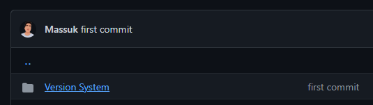
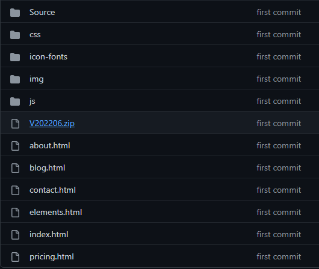
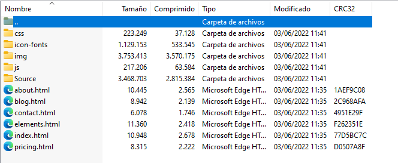

# Software Deployment Configuration

**1.** Para el despliegue de la solución dentro del repositorio de GitHub se tendrá que entrar en el sistema de control de versiones, ahí dependerá que versión queramos visualizar.

**2.** Se selecciona la versión del proyecto V202206

**3.** Una vez descargado el archivo V20200601.zip, se procede a descomprimirlo. Con ello se extrae toda la información necesaria para el despliegue de la solución. Para mostrar la página web se abre el archivo “index.html”.

