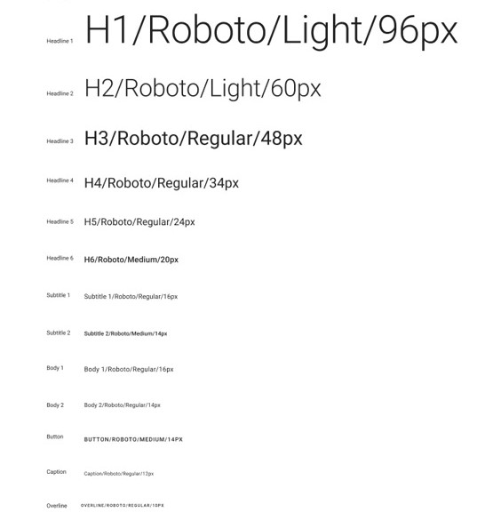
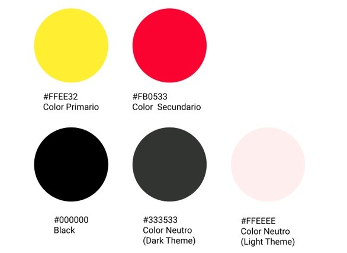
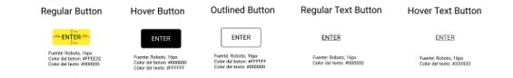
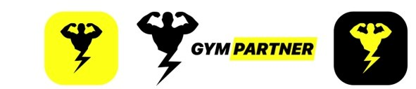

# Source Code Style Guide

A continuación presentamos conceptos generales para el diseño de la aplicación *GYM PARTNER* 
## Tipografía
Para nuestro proyecto utilizamos la tipografia Roboto. Los tamaños de texto son Header 1, Header 2, Header 3, Header 4, Header 5, Header 6. Asimismo se utilizo los siguientes elementos Subtitle 1, Subtitle 2, Body 1, Body2, Button, Caption, Overline.

## Paleta de colores
Los colores utilizados en el proyecto son el color primario "FFEE32", el color secundario "FB0533", el color black "000000". Tambien se utilizaron los colores neutros Dark Theme "333533" y Light Theme "FFEEEE"

## Spacing
Se definieron los siguientes tipo de botones: Regular Button, Hover Button, Outlined Button, Regular Text Button, Hover Text Button

## Branding
Para nuestro branding tomamos como referencia el color primario elegido. Se creo un logotipo acorde al proyecto, relacionado al mundo fitness.

## Tono de comunicación y lenguaje aplicado
El tono de comunicación y lenguaje aplicado que utilizará la aplicación *GYM PARTNER* es *Entusiasta/Motivador*. Lo cual se refleja en la paleta de colores. El amarillo intenso representa optimismo, juventud, alegría. Y el color rojo representa la fuerza y el poder. Estas caracteristicas son importantes que el cliente perciba para que genere un vínculo fuerte con la aplicación.
